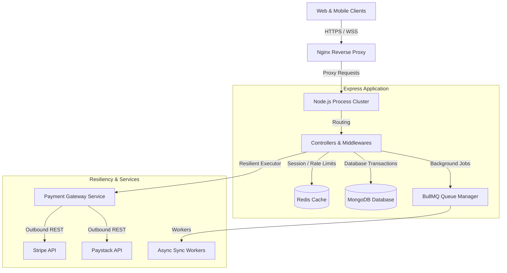
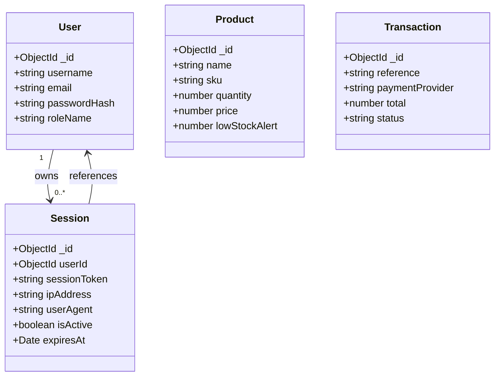

# System Design & Architecture: Stockora Enterprise

This document details the system design, architecture, security specifications, and resiliency mechanics of the Stockora Enterprise platform.

---

## 1. High-Level Architecture

Stockora Enterprise is designed as a highly scalable, resilient, and secure multi-warehouse Point of Sale (POS) and inventory platform. It utilizes a layered, decoupled service architecture:

---

## 2. Resiliency & Fault Tolerance Engine

To survive network fragmentation, database locks, and third-party API outages, Stockora implements a dedicated **Resiliency Engine** (`src/server/utils/resiliency/index.ts`):

### A. Circuit Breaker
Protects the system from cascading failure loops by blocking requests to downstream dependencies (like external payment APIs) once failure thresholds are breached:
- **CLOSED (Normal Operation)**: All requests flow through. If failures exceed $N$ within a window, the breaker trips to **OPEN**.
- **OPEN (Failing Fast)**: Instantly blocks requests with a local error, preventing socket lockups.
- **HALF_OPEN (Testing Recovery)**: After a reset cooldown timeout, a single request is allowed through. If successful, the breaker transitions back to **CLOSED**; otherwise, it returns to **OPEN**.

### B. Bulkhead Concurrency Isolation
Isolates resources by wrapping concurrent operations in isolated pools. Limits active concurrent task execution ($C$ parallel calls) and buffers extra requests in a capacity-controlled queue. Once the queue is full, incoming calls are fast-failed to prevent system thread exhaustion.

### C. Advanced Retry Engine
Executes operations under adaptive backoff policies:
- **Exponential Backoff**: Computes wait delays scaling exponentially: $t_{\text{delay}} = \text{base} \times 2^{\text{attempt}-1}$.
- **Jitter Strategy**: Infuses uniform random jitter to prevent "thundering herd" conditions: $t_{\text{wait}} = \text{random}(0, t_{\text{delay}})$.
- **Non-Idempotent Check**: If an operation is marked as non-idempotent (e.g. initiating payment transactions), the retry framework halts immediate repeats under failure to block duplicate requests and double-spending.

### D. Resilient Redis Reconnections
Instead of crashing or entering infinite connection loop locks, the Redis driver retry strategy uses a bounded exponential delay with full jitter, capping maximum reconnection attempts at $10$ to prevent severe memory leaks.

---

## 3. Security & Access Control Infrastructure

### A. Safe Proxy Client IP Extraction
To prevent spoofing or IP hijacking attacks via manipulated HTTP headers (such as forged `x-forwarded-for` values), the platform parses proxy header chains strictly:
- Extracts only the first (original client) IP in the comma-separated `x-forwarded-for` sequence.
- Trims and validates the IP pattern before comparing it to the session data.
- **Session Hijacking Deactivation**: If a request arrives with a session token but the client IP or User Agent deviates from the initial login properties, the middleware instantly deactivates the session database token and blocks access.

### B. Authentication Rate Limiter
Critical authentication endpoints (`/api/v1/auth/login`, `/api/v1/auth/register`) are hardened against automated brute force attacks. The platform enforces a strict policy allowing a maximum of **15 requests per 15 minutes** per IP.

### C. Webhook Signature Verification
All external webhook endpoints require HMAC cryptographic validation:
- **Stripe**: Computes SHA256 HMAC of the raw request payload using `STRIPE_WEBHOOK_SECRET`.
- **Paystack**: Computes SHA512 HMAC of the raw request payload using `PAYSTACK_WEBHOOK_SECRET` and matches it against the incoming `x-paystack-signature` header.
- **Double-Spend Verification**: Webhook handlers re-query the provider API directly to confirm the amount and currency of the transaction match expected invoice figures before marking orders as paid.

---

## 4. Database Schema Specifications

---

## 5. Development Localhost Network Expose

To facilitate direct mobile testing on identical local Wi-Fi networks:
- **Vite Configuration**: Exposes local network addresses by mapping `host: true` (binding to `0.0.0.0`) in `vite.config.ts`.
- **Responsive Layout Design**: The checkout and cart panels toggle sticky container styles off and transition to natural grid wrappers on mobile screens (`< lg` viewports), enabling seamless checkout on compact smartphone displays.
