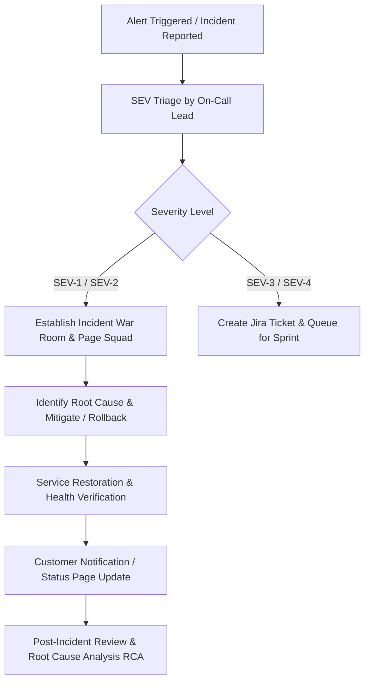

# Stockora Enterprise — Incident Response Guide

## 1. Incident Severity Matrix

| Severity | Definition | Target Response (SLA) | Target Resolution (SLA) |
| :--- | :--- | :--- | :--- |
| **SEV-1 (Critical)** | Core outage (login down, checkout down, data bleed, billing failure). | < 15 minutes | < 2 hours |
| **SEV-2 (Major)** | Degraded service (reports delayed, email queue backlog, search degradation). | < 30 minutes | < 4 hours |
| **SEV-3 (Moderate)** | Minor functionality impaired with available workaround (UI visual glitch). | < 2 hours | < 24 hours |
| **SEV-4 (Low)** | Non-blocking bug or administrative feature request. | < 8 hours | Next sprint |

## 2. Incident Management Workflow

## 3. Escalation Roster & Responsibilities

- **Incident Commander (IC)**: Leads triage, coordinates engineering mitigation, and directs rollback decisions.
- **Communications Lead**: Updates status page (`status.stockora.enterprise`) and communicates with impacted enterprise tenants.
- **Engineering Leads**: Diagnose logs, trace metrics, isolate root cause, and deploy hotfix or rollback.
